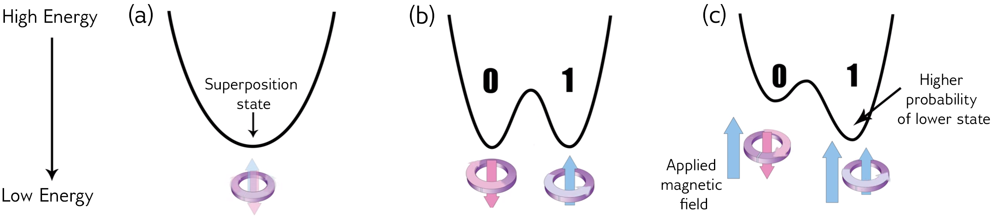

.. _research:

Research Interests
==================

There are a few parallels that can be drawn between my research interests/experience, both in AMO physics and high-energy astrophysics, and the work done at D-Wave. Comparisons of a few examples of related concepts are presented in the following sections.

.. * Using an applied magnetic field to control the depth of the potential well
    * spin alignment energy minimization
.. * Correlation lengths / coupling strength

.. important:: 

    The following content assumes that the reader has some knowledge of quantum mechanics.

.. .. panels::

..     Top left 

..     ----

..     top-right

Cold Atom Systems
-----------------

Atoms can be trapped using light, electric fields, or magnetic fields such that they are suspended in an ultra-high vacuum chamber, spatially confined and isolated from the walls. In a **3D magneto-optical trap (MOT)** consisting of 3 pairs of counter-propagating beams, atoms are slowed down via **laser cooling** and trapped via a pair of concentric coils in an *anti-Helmholtz* configuration spaced one coil radius apart. Laser cooling can be thought of as "**momentum trapping**" as it depends on velocity (and not position). For "**position trapping**", the trapping force is provided by a **spatially-varying magnetic field**. At the centre of the MOT, the combination of the two results in a **trapping potential**, with trap depth :math:`U_{\operatorname{trap}}=\frac{1}{2}mv_e^2`, where :math:`v_e` is the minimum trap escape speed. The depth is controlled by the parameters of the confining fields (e.g. magnetic field gradient).

In addition to the MOT is the **magnetic trap (MT)**, which is bad at cooling and trapping atoms (thus, the need for the MOT). A quadrupole can be formed using the same coils as for the MOT, though this time with a higher current to produce a greater magnetic field gradient; the laser light is also turned off. For a **step-by-step description of the experimental sequence**, see the dropdown menu below.

.. dropdown:: Step-by-step experimental sequence
    :animate: fade-in-slide-down

    .. figure:: MTsummary.png
      :name: MTsummary
      :figwidth: 50%
      :align: center

      This experimental sequence involves loading the MOT with atoms, transferring the atomic sample to the MT, waiting for a certain hold time :math:`t`, and then making a measurement.

    | **A**  Measure fluorescence :math:`V` from the SS (steady state)
    |        (*Turn on MOT light and allow it to reach steady state fluorescence voltage :math:`V_{\operatorname{MOT}}`*)
    | **B**  Turn off light, :math:`\uparrow \vec{B}` to load trap. Atoms are held from time :math:`t`
    | **C**  MOT light back on, :math:`\downarrow \vec{B}` back to original MOT setting
    |        (Turn on MOT light briefly to check the number of atoms in the trap (by measuring fluorescence). The MOT loads briefly during this measurement, but this is OK since we use this line to extrapolate the fluorescence -- after the MOT light is back on)
    | **D**  :math:`\vec{B}` off and allow trapped atoms to escape. MOT light is ON to record background light level
    |        (Empty MOT by turning off the magnetic field and measuring the background voltage)
    | **E**  :math:`\vec{B}` on to allow MOT to reload completely before returning to step **A**, varying :math:`t` with each cycle
    |        (Reset the MOT -- i.e. MOT light still on, :math:`\vec{B}` back on)

The Double-Potential Well and Evaporative Cooling
^^^^^^^^^^^^^^^^^^^^^^^^^^^^^^^^^^^^^^^^^^^^^^^^^

**Evaporative cooling** can be understood by analogy to *cooling a cup of coffee by blowing on it*. The speed of atoms in an atomic gas can be described by the `Maxwell-Boltzmann distribution <https://en.wikipedia.org/wiki/Maxwell%E2%80%93Boltzmann_distribution>`_; the most energetic atoms occupy the high-energy tail of the distribution. By removing high-energy atoms, the remaining atoms re-equilibrate through elastic collisions, lowering the temperature of the sample. In hot coffee, the most energetic particles escape as vapour, taking with them their share of energy and thus temperature.

For producing Bose-Einstein Condensates (BECs), evaporative cooling can be used to cool trapped atoms (:numref:`coolramp`). The walls of the trapping potential can be lowered by **tuning parameters** such as the magnetic field strength or laser frequency.

    The evaporative cooling process of trapped atoms. In (a), high-energy atoms can move higher up the walls; (b) the walls are lowered and the most energetic atoms can escape; (c) the remaining atoms rethermalize collisionally.

We can compare this to the **tuning** of an applied magnetic field to control the depth of the **double-potential well** in the annealing process (:numref:`change`). 

    Energy diagram over time during the annealing process and application of bias field (Fig. 5 of `How Quantum Annealing Works in D-Wave Systems <https://docs.dwavesys.com/docs/latest/c_gs_2.html#how-quantum-annealing-works-in-d-wave-systems>`_)

Annealing and Field-Seeking States
^^^^^^^^^^^^^^^^^^^^^^^^^^^^^^^^^^

.. role:: latex(code)
   :language: latex

The system (a set of qubits) begins the annealing process in the ground state of the **initial Hamiltonian** :math:`\mathcal{H}_i`. For D-Wave, this looks like

.. math::

    \mathcal{H}_i = \underbrace{-\frac{A(s)}{2}\left(\sum_{i} \hat{\sigma}_{x}^{(i)}\right)}_{\text {Initial Hamiltonian }}

As it anneals, the final or **problem Hamiltonian** :math:`\mathcal{H}_{\operatorname{problem}}` is introduced. During the annealing process, the system evolves under the full Hamiltonian :math:`\mathcal{H}_{\operatorname{Ising}}`:

.. math::

    \begin{align*}
    \mathcal{H}_{\operatorname{Ising}} &= \mathcal{H}_{\operatorname{initial}} + \mathcal{H}_{\operatorname{final}} \\
     &\\
    \mathcal{H}_{\operatorname{Ising}} &=  \underbrace{-\frac{A(s)}{2}\left(\sum_{i} \hat{\sigma}_{x}^{(i)}\right)}_{\text {Initial Hamiltonian }}+\underbrace{\frac{B(s)}{2}\left(\sum_{i} h_{i} \hat{\sigma}_{z}^{(i)}+\sum_{i>j} J_{i, j} \hat{\sigma}_{z}^{(i)} \hat{\sigma}_{z}^{(j)}\right)}_{\text {Final Hamiltonian }}
    \end{align*}

At the end of the anneal, the system will be in an eigenstate of the problem Hamiltonian (we see this in (c) from :numref:`change`). The probability of each qubit falling into the 0 or 1 state can be controlled by applying a **field bias** (an external magnetic field). In the presence of the bias, the qubit minimizes its energy.

We can compare the following two concepts:

    * The spin state of a qubit minimizing its energy by aligning with the external magnetic field (**quantum annealing**).
    * The magnetic moments of atoms will minimize their energy by moving to regions of higher/lower field strengths, depending on its alignment (:math:`\uparrow\uparrow` and :math:`\downarrow\uparrow`, respectively) (**atom trapping**).

High- and Low-Field Seeking States
++++++++++++++++++++++++++++++++++

Consider atoms in a MT with a magnetic field gradient superimposed onto a uniform field. Atoms want to occupy the 'new' lowest energy states (like the qubit in a bias field). Atoms whose magnetic moments are aligned (:math:`\uparrow\uparrow`) with the field will have lower energies in a higher field [#foot4]_. 

Similarly, low-field seeking atoms (with anti-aligned (:math:`\uparrow\downarrow`) magnetic moments) will tend toward regions with lower field strength [#foot5]_.

In reality, both the total electronic angular momentum (:math:`L, S`) and atomic angular momentum (:math:`J, I`) are constantly changing; thus, atoms act more like a pendulum, switching between high- and low-field seeking states. Untrapped atoms do not interact with the field and fly out of the trap.

All of the above (in this section) are in reference to the subfigures in :numref:`fieldseeking`.

    
    Various configurations for field-seeking atoms. (a) high-field seeking atoms, (b) low-field seeking, (c) "tumbling" atoms, (d) untrapped atoms. See my :ref:`QDG` for further reading.

.. [#foot4] The energy :math:`\Delta E` that atoms lose to the Zeeman interaction is :math:`\propto \vec{B}`.
.. [#foot5] They lose :math:`\Delta E` to the Zeeman effect at a slower rate as :math:`R\rightarrow 0`

.. _highenergyastro:

High-Energy Astrophysics 
------------------------

In a strongly magnetized vacuum, nonlinear QED interactions induce **birefringence**; effectively, the propagation speed of photons in the two linear polarization modes (O- and X-modes) differ under these conditions [Mignani2019]_. Vacuum birefringence influences the adiabatic evolution of highly polarized thermal emission of neutron stars (NSs) in two ways:

    1. *Polarization mode decoupling in NS magnetospheres*: polarization vectors tend to align with the varying magnetic field orientation of each surface element -- that is, up to some large limiting radius away from the surface, after which the polarization becomes '**frozen**' [Heyl2002]_. The result is a large observed net polarization, rather than the *a priori* expected depolarization, for the integrated light.
    2. *Mode conversion in NS atmospheres*: at a particular frequency, an X-mode photon may be converted into the O-mode (or O :math:`\rightarrow` X) as it traverses a "**vacuum resonance**" arising from competing **vacuum** and **plasma birefringent** effects. This produces a unique energy-dependent polarization signature, determined by the plasma density and magnetic field strength. 

.. [Mignani2019] Roberto Mignani, Andrew Shearer, Agnieszka Słowikowska, and Silvia Zane. AstronomicalPolarisation from the Infrared to Gamma Rays. Springer, 2019.
.. [Heyl2002] Jeremy S Heyl and Nir J Shaviv. Qed and the high polarization of the thermal radiation from neutronstars. Physical Review D, 66(2):023002, 2002.

.. _adiabatic:

Adiabaticity in Quantum Computing, Polarization States, and Cyclotron Resonance
^^^^^^^^^^^^^^^^^^^^^^^^^^^^^^^^^^^^^^^^^^^^^^^^^^^^^^^^^^^^^^^^^^^^^^^^^^^^^^^^

The Minimum Energy Gap and Cyclotron Resonance
++++++++++++++++++++++++++++++++++++++++++++++

Predominantly, two factors can cause the system to jump (or traverse the minimum gap) from the ground state to a higher energy state:

    1. Thermal fluctuations
    2. Annealing runs **too quickly**

To avoid interference from the environment, the annealing process evolves the Hamiltonian slowly as an **adiabatic process**. 

.. dropdown:: About the energy eigenspectrum
    :animate: fade-in-slide-down

    .. figure:: eigenspectrum.png
      :name: eigenspectrum
      :figwidth: 60%
      :align: center

      The energy eigenspectrum, where the ground state is the lowest energy state and higher excited states are above. A non-adiabatic process provide enough energy to jump the minimum gap to excited states. (Fig. 7 of `Annealing in Low-Energy States <https://docs.dwavesys.com/docs/latest/c_gs_2.html#annealing-in-low-energy-states>`_)

Traversing the Cyclotron Resonance
++++++++++++++++++++++++++++++++++

With vacuum birefringence, the expected polarization fraction (the degree of polarization) is larger for:

    * Smaller neutron stars
    * Higher energies... up until the **cyclotron resonance**

.. dropdown:: Slowly traversing the cyclotron resonance
    :animate: fade-in-slide-down

    .. figure:: modes.png
      :name: modes
      :figwidth: 60%
      :align: center

    This is a hand-drawn picture by J.S. Heyl showing the resonance crossings (circled). Note that the frequencies on the x-axis is scaled by the cyclotron resonance :math:`\omega_B`. This image can be contrasted with :numref:`eigenspectrum` (Fig. 7 of `Annealing in Low-Energy States <https://docs.dwavesys.com/docs/latest/c_gs_2.html#annealing-in-low-energy-states>`_).

.. math:: 

    \begin{align*}
    \sigma_{\operatorname{O}} &\approx \sigma_T \left(\frac{\omega^2}{(\omega_c+\omega)^2} + \frac{1}{2}\sin^2\theta \right) \\
    \sigma_{\operatorname{O}} &\approx \sigma_T \left(\frac{\omega^2}{(\omega_c-\omega)^2} + \frac{1}{2}\sin^2\theta \right)
    \end{align*}

where :math:`\sigma_T` is the Thomson scattering cross section.

As :math:`\omega\rightarrow\omega_c`, the :math:`X`-mode cross section increases, becoming larger than the :math:`O`-mode's. However, very close to the resonance where :math:`\omega\sim\omega_c`, the energy transfer from photons heats up electrons and damping effects must be taken into consideration (the equations for :math:`\sigma_{\operatorname{O}}` and :math:`\sigma_{\operatorname{X}}` are no longer valid).

The **resonant scattering** occurrs when the photon frequency (in the electron's rest frame, where scattering is nonrelativistic) equals the cyclotron frequency (:math:`\omega=\omega_c`). Looking at the above expressions for :math:`\sigma_{\operatorname{O}}` and :math:`\sigma_{\operatorname{X}}`, we see that for a photon travelling along and across the field, only the :math:`X`-mode photons are resonantly scattered. Radiation from the atmosphere is mostly **polarized perpendicular** (:math:`X`), and so it will remain in its (perpendicular) polarization state after the resonant scattering. If we were to 'look more closely', including geometric considerations, we find that the resonant scattering can switch the polarization states [Caiazzo2019]_. 

Near the cyclotron resonance (and including thermal effects), I theoretically calculated a **critical photon energy** :math:`E_{\gamma}^{\operatorname{crit}}`, above which the evolution is adiabatic. This leads us to the following conclusion:

    *If* :math:`E_{\gamma} > E_{\operatorname{adiabatic}}`, *then we have a transformation of the polarization (mode-flipping from* :math:`X \rightarrow O`) *as the photon crosses the resonance.*

What if :math:`E_{\gamma} < E_{\operatorname{adiabatic}}`? In this case, the polarization would remain perpendicular (:math:`X`). We can calulate what happens to the polarization mode as the photon crosses resonance by looking at the :ref:`adiabatic criterion <adiabaticcriterion>`.

.. _adiabaticcriterion:

The Adiabatic Criterion
+++++++++++++++++++++++

A birefringent medium is an anisotropic medium through which the index of refraction depends on the polarization direction of light. Consider simplest case of uniaxial birefringence, where the anisotropy is driven by a single axis and the medium is still rotationally symmetric about this 'special axis'. 

As light travels through the medium, the component polarized parallel to this special axis can propagate faster (or slower) than the orthogonal component. The amplitude of the birefringent vector :math:`\hat{\mathbf{\Omega}}` is given by

.. math::

    |\hat{\mathbf{\Omega}}| = |k_0 \Delta n| \qquad \text{where}\ \Delta n = n_{\parallel} - n_{\perp}

where :math:`k_0` is the wavenumber of radiation in the vacuum. The change in the **Stokes parameters** is

.. math::
    
    \frac{d\mathbf{s}}{d\lambda} = \hat{\mathbf{\Omega}} \times \mathbf{s}

where :math:`\lambda` measures the mean free path of the photon in the medium [Caiazzo2019]_. 

In general, if :math:`|\hat{\mathbf{\Omega}}|` is sufficiently large, the vector :math:`\mathbf{s}` will circle the direction of :math:`\hat{\mathbf{\Omega}}`, even when :math:`\hat{\mathbf{\Omega}}` changes direction and magnitude -- if it does so sufficiently slowly. Specifically, if the initial polarization is parallel to :math:`\hat{\mathbf{\Omega}}`, the polarization state will remain nearly parallel to :math:`\hat{\mathbf{\Omega}}` as long as

.. math::

    \left| \hat{\Omega} \left(\frac{d\ln |\hat{\Omega}|}{d\lambda} \right)^{-1} \right|

This equation is known as the **adiabatic criterion**. If it holds, the polarization states evolve adiabatically, and the polarization direction will follow the direction of birefringence [Caiazzo2019]_.

Notice that this adiabadicity requirement is important for **adiabatic quantum computing** as well, specifically during the annealing process.

.. [Caiazzo2019] Ilaria Caiazzo. QED and X-ray polarization from neutron stars and black holes. PhD thesis, University of British Columbia, 2019.

Polarization Freezing and Freezeout Points
^^^^^^^^^^^^^^^^^^^^^^^^^^^^^^^^^^^^^^^^^^

In the section above on :ref:`vacuum birefringence <highenergyastro>`, *polarization mode decoupling in NS magnetospheres* occurs up to a certain radius -- called the **polarization-limiting radius**. After re-coupling, the polarization becomes **frozen** (this is the polarization state we detect).

Similarly, the **spin state of a qubit** may also become **frozen**. The analogous term for the polarization 'freezeout' radius would be **freezeout points** for qubit dynamics. To understand the role of these points in the annealing process, we need to look at the two relevant energy scales:

   * :math:`A(s)` -- the transverse or tunneling energy. It sets the timescale for qubit dynamics. 
   * :math:`B(s)` -- the energy applied to the problem Hamiltonian.

.. seealso::

    The definitions listed here for energy scales :math:`A(s)` and :math:`B(s)` are simplified. See `Annealing Energy Functions <https://docs.dwavesys.com/docs/latest/c_qpu_0.html#annealing-energy-functions>`_ for more information.

As annealing progresses, the timescale :math:`A(s)` decreases. The overall timescale of the anneal is given by :math:`t_f`. When the evolution of the (complex Ising) spin system become slow compared to :math:`t_f`, we say that the network is **frozen** -- that is, the spin state does not change appreciably as the Ising spin Hamiltonian evolves. In general, each Ising spin problem has different dynamics; however, it is useful to analyze a simple system composed of clusters of *uniformly coupled qubits* called **logical qubits**. 

Networks of these logical qubits *freeze out* at different points during the anneal, depending on factors such as:

    * Number of qubits :math:`N` in the network
    * Coupling strengths between qubits
    * Overall timescale :math:`t_f`

.. dropdown:: More on energy scales and annealing schedules (NOT DONE)
    :animate: fade-in-slide-down

    We define a *standard annealing schedule* :math:`s=t/t_f`, where :math:`t_f` is the *annealing time*. A single, global, time-dependent bias controls the evolution of :math:`A` and :math:`B` and at any intermediate value of :math:`s` the ratio :math:`A(s)/B(s)` is fixed.

.. put in fig 73

Optimization with D-Wave QPUs and MLOO
^^^^^^^^^^^^^^^^^^^^^^^^^^^^^^^^^^^^^^

* link to MLOO for optimization

|

.. https://support.dwavesys.com/hc/en-us/community/topics/360000211733-Physics

.. https://support.dwavesys.com/hc/en-us/articles/360003680954-What-Is-Quantum-Annealing-

Quantum many-body systems
-------------------------

Non-equilibrium dynamics

Tuning Correlation Lengths
^^^^^^^^^^^^^^^^^^^^^^^^^^
Correlation lengths and the unitary limit (tuning interaction strengths)... Tuning Correlation Lengths?
